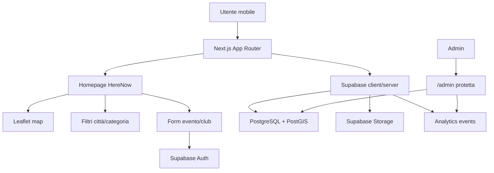

# HereNow - Architettura consigliata

## Scelta stack

La base implementata usa Next.js come applicazione React principale, Supabase come backend PostgreSQL/Auth/Storage, Leaflet per la mappa e Vercel per il deploy. Questa scelta privilegia i requisiti dettagliati del prodotto: autenticazione Supabase, RLS, immagini ottimizzate con `next/image`, deploy Vercel e pagine protette come `/admin`.

La richiesta iniziale cita React/Vite e FastAPI. Per non bloccare la crescita futura, il codice separa UI, tipi, servizi Supabase, config geografiche e SQL: in seguito puoi aggiungere FastAPI come API gateway esterno senza riscrivere database o UI.

## Schema funzionale

## Moduli principali

- `app/`: pagine Next.js, layout globale, login, admin e callback auth.
- `components/home/`: esperienza mobile-first della homepage.
- `components/map/`: Leaflet, bounds città, marker e popup evento.
- `components/ui/`: componenti UI riusabili.
- `lib/supabase/`: client/server Supabase e query iniziali.
- `lib/data/`: dati demo usati quando Supabase non è ancora configurato.
- `lib/types.ts`: tipi condivisi per UI, DB e servizi.
- `supabase/`: schema SQL, policy RLS e seed iniziale.
- `docs/`: istruzioni operative.
- `scripts/`: utilità di backup.

## Database Supabase

Tabelle:

- `profiles`: profilo collegato a `auth.users`, con ruolo `user/admin`.
- `cities`: città supportate, coordinate centrali, bounding box e raggio.
- `categories`: categorie color-coded IT/EN.
- `events`: evento geolocalizzato con `location geography(Point,4326)`.
- `clubs`: club proposti dagli utenti.
- `event_images`: immagini multiple future per evento.
- `analytics_events`: tracking privacy-friendly.

Indici:

- `events(city_id)`, `events(category_id)`, `events(start_date)`, `events(status)`, `events(created_by)`.
- `events(latitude, longitude)` per filtri semplici.
- `events_location_gix` GiST su `geography` per query PostGIS.
- Indici su città, categorie, club e analytics.

## Regole sicurezza

- RLS attiva su tutte le tabelle applicative.
- Tutti possono leggere solo eventi approvati.
- Utenti autenticati possono creare eventi e club solo in stato `pending`.
- Utenti possono modificare solo i propri contenuti ancora `pending`.
- Admin può approvare, rifiutare, modificare eventi e gestire città/categorie.
- Il cambio ruolo profilo è bloccato per non-admin da trigger.
- Le immagini evento sono pubbliche in lettura, ma upload/update/delete sono limitati alla cartella dell'utente autenticato.

## Geografia

Ogni città ha:

- coordinate centrali (`latitude`, `longitude`);
- `bbox` con `south/west/north/east`;
- `radius_km` per future ricerche "vicino a me".

Quando l'utente seleziona una città, la mappa si centra sui bounds e gli eventi vengono filtrati per `city_id`, status approvato, data futura e bounding box. Il database salva anche `location geography(Point,4326)` per query future con `ST_DWithin`.

## Analytics

La prima opzione è interna: inserimento in `analytics_events` di eventi come `page_view`, `city_selected`, `category_selected`, `event_clicked`, `event_created`, senza IP o fingerprinting invasivo.

Alternative future:

- Vercel Analytics per metriche web molto rapide.
- Plausible per analytics privacy-friendly ospitate.
- PostHog se serviranno funnel, feature flags o session replay, usando configurazioni privacy-first.
